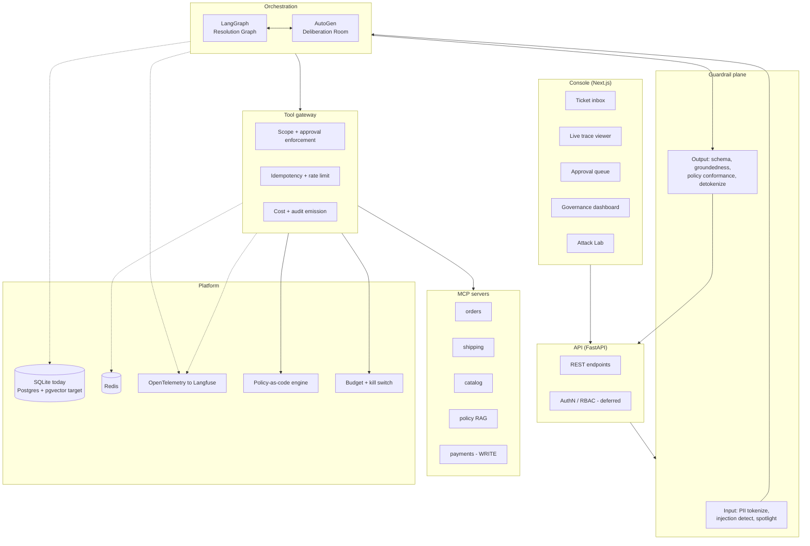
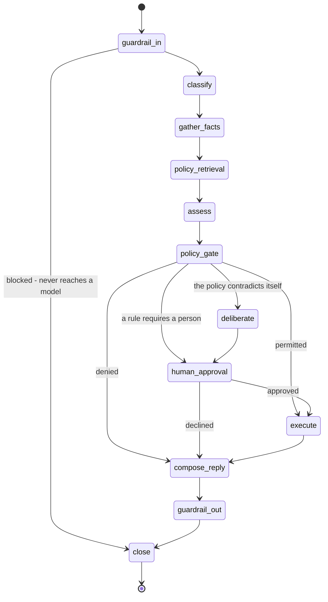

# Architecture

> **This document describes the target architecture.** Most of it is built and
> running; a few parts are deliberately staged. Where the two differ, the text says
> so inline, and the [roadmap](roadmap.md) carries a `Deferred` list under every
> phase with the full account. Nothing here is aspirational without saying it is.

## 1. Design principles

1. **The domain drives the stack.** Nothing is included to demonstrate a framework. Every
   layer answers a concrete question the retail-refund domain forces on us.
2. **Untrusted text never becomes instruction.** Customer-authored content is data. It is
   tokenized, spotlighted, and never concatenated into a system prompt.
3. **Capability, not persuasion.** An agent cannot issue a refund because it convinced
   itself it should. It can only do so if the tool gateway holds a matching scope and,
   above threshold, a signed human approval token.
4. **Determinism where it is cheap, emergence where it pays.** A state machine handles the
   85% of tickets that follow policy. A multi-agent debate handles the ambiguous tail — and
   we measure whether that is actually worth its cost.
5. **Every decision is reconstructable.** Prompt version, model id, retrieved policy
   clauses, tool calls, guardrail verdicts and human approvals are hash-chained into a
   dossier that can be replayed.

---

## 2. System overview



---

## 3. The resolution graph (LangGraph)

The primary path. A typed state machine, checkpointed so a ticket can pause for days
waiting on a human and resume exactly where it stopped. The API checkpoints to
SQLite today and tests use an in-memory saver; Postgres arrives with the
`PostgresStore` (see ADR 0005).



There is no edge from `deliberate` to `execute`. The room recommends; a person
decides, and the absence of that edge is the guarantee rather than a rule in a
prompt.

### State

```python
class ResolutionState(TypedDict, total=False):
    ticket_id: str
    raw_message: str          # exactly what arrived; never placed in a prompt
    safe_message: str         # normalised and PII-tokenised; this is what a prompt may carry
    pii_vault: dict[str, str] # placeholder -> value, held beside the prompt
    spotlight_marker: str
    canary: str

    guardrail_events: list[dict]
    intent: str
    order_id: str | None
    facts: dict               # tool output, keyed by tool name
    fact_gaps: list[str]      # tools that failed; a missing fact degrades the decision
    policy_refs: list[dict]
    retrieved_clause_ids: list[str]

    assessment: dict          # what the model proposed
    policy_decision: dict     # what deterministic code decided
    deliberation: dict
    approval: dict | None
    execution: dict | None
    reply: str | None
    released_reply: str | None

    audit_sequences: list[int]
    model_calls: list[dict]
    cost_usd: str
    status: str
    failure: str | None
```

Every field is JSON-serialisable, and that constraint drives the design: the state
is checkpointed after every node, so anything that cannot survive the round trip
cannot live there.

Notes that matter:

- `gather_facts` fans out to the tool plane concurrently with `asyncio.gather`; a partial
  failure records a gap and the assessment prompt is told what is missing, rather than
  the ticket failing or the decision being made on half the facts without saying so.
- `human_approval` is a real LangGraph `interrupt()`. The graph stops, the API returns, the
  approval lands in the console queue, and a resume call rehydrates the checkpoint.
- `guardrail_out` blocks rather than repairing. A reply that fails groundedness, policy
  conformance or the leak scan is not sent, and the ticket is left for a person. A
  repair-and-retry loop is deferred: asking the model that just produced an ungrounded
  answer to try again is not obviously safer than not sending it.

---

## 4. The deliberation room (AutoGen)

Convened only when the *policy engine* flags a ruling as `ambiguous` - meaning the
clauses genuinely conflict, rather than a clear rule simply requiring a person. Three
roles argue and a fourth reads:

| Agent | Mandate |
|---|---|
| **PolicyAnalyst** | Argues strictly from retrieved policy clauses. May not invent exceptions. |
| **CustomerAdvocate** | Argues for customer lifetime value and goodwill, cites customer history. |
| **FraudInvestigator** | Argues the adversarial case: return-abuse patterns, claim frequency, address reuse. |
| **Arbiter** | Does not debate. Reads the transcript and emits a structured `DeliberationVerdict`. |

The arbiter is not an AutoGen participant. It reads the finished transcript, so it cannot
be argued with.

Constraints applied: a hard message cap, a budget that stops a long argument, read-only
principals, and a model client that refuses tool calls outright - an unbounded
conversation with tool access is an unbounded number of tool calls. Only the LangGraph
`execute` node can move money.

Every AutoGen model call routes through the Backstop client, so the room's spending reaches
the same ledger, budget ceiling and span as everything else. AutoGen orchestrates; Backstop
meters.

The verdict returns to the graph as data. **AutoGen never terminates a ticket.**

### Why both

This is the comparison the project is built to make. **It is not measured yet** - the
room, the routing and the containment exist; the write-up does not, and it is listed as
deferred in the [roadmap](roadmap.md) rather than quietly implied. When it lands it
should report, on the same golden set:

- resolution accuracy and policy-citation precision
- USD per ticket and p95 latency
- **output variance** - the same ticket run 10 times, measured for decision stability
- escalation precision and recall

The hypothesis worth testing publicly: emergence buys accuracy on the ambiguous tail and
loses badly on cost and determinism everywhere else.

---

## 5. Tool plane (MCP)

Five servers, written in this repo, speaking MCP over stdio locally and streamable HTTP in
deployment. Both orchestrators bind to the same servers, which is the point: swapping the
reasoning engine does not change the capability surface.

| Server | Tools | Scope |
|---|---|---|
| `orders` | `get_order`, `list_customer_orders`, `get_customer_profile` | read |
| `shipping` | `track_shipment`, `get_delivery_events` | read |
| `catalog` | `get_product`, `get_return_eligibility` | read |
| `policy` | `search_policy`, `get_policy_section` | read (lexical index) |
| `payments` | `issue_refund`, `issue_store_credit`, `create_replacement_order` | **write, approval-gated** |

### The tool gateway

Agents do not call MCP servers directly. Every call passes through a gateway that:

1. resolves the caller's **scope set** and rejects out-of-scope tools before invocation;
2. checks the **policy engine** - e.g. `issue_refund` requires `amount <= policy.max_auto_refund`
   *and* a valid approval token above that;
3. enforces an **idempotency key** derived from `(ticket_id, tool, args_hash)` so a graph
   replay after a crash cannot double-refund;
4. applies per-tenant **rate limits** and a **budget circuit breaker**;
5. emits a signed **audit entry** and an OpenTelemetry span with token and USD cost.

This layer is what makes the security and governance stories real rather than decorative.

---

## 6. Guardrail plane

### Input pipeline

```
raw ticket
  -> length + encoding normalization (unicode confusables, zero-width strip)
  -> language detection (tr / en)
  -> PII detection (hand-written recognisers with checksum validation:
     TCKN, IBAN mod-97, Luhn; plus a name gazetteer)
  -> tokenization: "Ayse Yilmaz" becomes <PERSON_1>, restored only at the final channel
  -> injection detection:
        structural patterns | lexical phrases | instruction-density score
        | canary-token check (on output)
  -> spotlighting: untrusted text delimited and framed as data
```

Injection detection is **layered on purpose** - the lab teaches why a single detector is
not a control. Two independent layers agreeing is what blocks; one alone escalates. Detection results are advisory to the graph, never silently mutating.

### Output pipeline

```
model output
  -> Pydantic schema validation (typed decision, not prose parsing)
  -> groundedness: every policy claim must cite a retrieved clause id
  -> policy conformance: decision + amount re-checked against policy-as-code
  -> PII leak scan (must not surface tokens the channel is not authorized for)
  -> tone / toxicity
  -> detokenization for the authorized channel only
```

The re-check in step 3 is deliberate defense in depth: the model proposes, the deterministic
policy engine disposes.

---

## 7. Governance plane

| Artifact | Purpose |
|---|---|
| **Hash-chained audit log** | Append-only Postgres table; `entry_hash = sha256(prev_hash + canonical_json(payload))`. A verifier CLI proves the chain is intact. |
| **Prompt registry** | Every prompt is a versioned YAML with an owner, changelog and content hash. Code references prompts by `name@version`; CI fails if a referenced version is missing or its hash drifted. |
| **Model cards** | One per agent role: purpose, data, in and out of scope uses, measured eval scores, known failure modes, risk classification. |
| **Risk assessment** | EU AI Act classification and reasoning, NIST AI RMF control mapping, DPIA for the PII flow. |
| **Budget + kill switch** | Per-tenant daily USD and token ceilings; a circuit breaker that degrades to human-only handling; a global kill switch honored by the tool gateway. |
| **Decision dossier** | Per-ticket export: inputs, prompt versions, model ids, retrieved clauses, every tool call, guardrail verdicts, human approvals, final action. |

---

## 8. Evaluation

| Suite | Contents | Gate |
|---|---|---|
| `evals/golden` | Labelled scenarios bound at run time to real dataset records: expected intent, escalation, deliberation, clause family | any metric below its floor fails the PR |
| `evals/judges` | LLM-as-judge rubrics for reply quality (correctness, completeness, tone, no PII leak) | mean score drop > 0.3 fails |
| `evals/redteam` | Direct injection, indirect injection (hostile text inside a product review the agent retrieves), encoding attacks, TR/EN multilingual, tool abuse, PII exfiltration | attack success rate > 2% fails |
| cost and latency | USD per ticket, p95 end-to-end | cost regression > 20% fails |
| safety invariants | unauthorized write attempts, double refunds, policy violations | any occurrence fails |

Indirect injection deserves the emphasis: the nastiest realistic attack is not in the
customer's message, it is in the *product review text the policy RAG retrieves*.

---

## 9. CI/CD

| Workflow | Trigger | What it enforces |
|---|---|---|
| `ci.yml` | every push | ruff, mypy strict, pytest + coverage, web lint/typecheck/build, docker build |
| `evals.yml` | PR touching `packages/**` or `governance/prompt-registry/**` | golden set + judges, posts a score-diff table as a PR comment, blocks on regression |
| `redteam.yml` | nightly + PR touching guardrails or prompts | attack success rate gate, publishes an ASR trend artifact |
| `security.yml` | every push + weekly | gitleaks, pip-audit, `npm audit`, CycloneDX SBOM |
| `governance.yml` | every push | prompt hash integrity, model card presence for every registered agent, policy rule unit tests |
| `release.yml` | tag | semantic release, canary deploy, smoke evals against canary, auto-rollback on failure |

---

## 10. Data and infrastructure

- **Postgres 16 + pgvector** - the target home for checkpoints, the audit chain and
  dense policy embeddings. Today the domain store is in memory, the checkpointer is
  SQLite and retrieval is lexical; see ADR 0005 and the roadmap's deferred lists.
- **Redis** - idempotency keys, rate limit counters, distributed locks, hot caches.
- **Langfuse** - LLM trace storage and prompt-level analytics.
- **Grafana + Prometheus** - dashboards committed as JSON: cost per ticket, escalation
  rate, guardrail block rate, ASR trend, p95 latency by node.
- All of it runs from a single `docker compose up`. A reviewer must be able to clone and
  run the system in under ten minutes.

---

## 11. LLM provider strategy

Multi-provider with **OpenAI as primary**, Anthropic and a local Ollama tier as alternates,
behind one interface in `packages/llm`:

- **Router** picks a tier per task class: cheap tier for classification and detectors,
  strong tier for assessment and the arbiter, local tier for offline development.
- **Fallback** on provider error or rate limit, recorded in the audit entry.
- **Cost meter** normalizes per-provider pricing into one USD ledger.
- The multi-provider setup is what makes the model registry and the "which model decided
  this" governance question non-theoretical.
